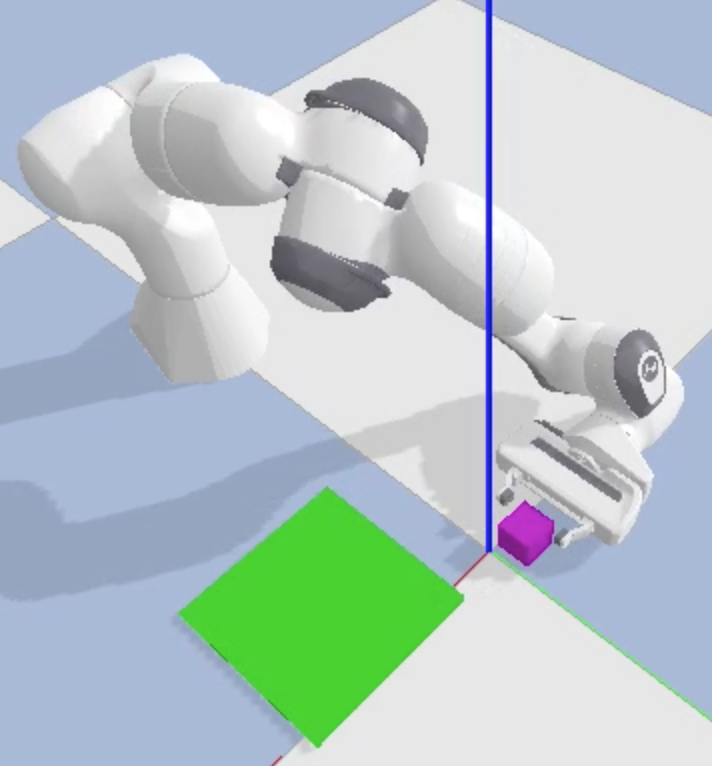

# Visual Motor Behaviour Cloning

This repository contains a method for a visual motor behaviour cloning policy for an industrial-like pick and place task. The task was approached as a classification problem with a collaborative robot arm executing discrete actions based on visual feedback. Our policy was able perform the task with a success rate of 87% with a model trained with 250 expert trajectories. The model was able to demonstrate real-time visual feedback control even in the presents of external disturbances.

## Getting Expert Data
To generate training data, run:
```
VIBE/robot_generate_expert_data.py
```

## Training A Model
To begin training a model use:
```
VIBE/CNN_Train.py 
```
It is required to have a GPU to train, I suggest using Google Colabratory.

## See the Results
To run the simulation using the model update the model name and run:
```
VIBE/robot_CNN_actions.py 
```


