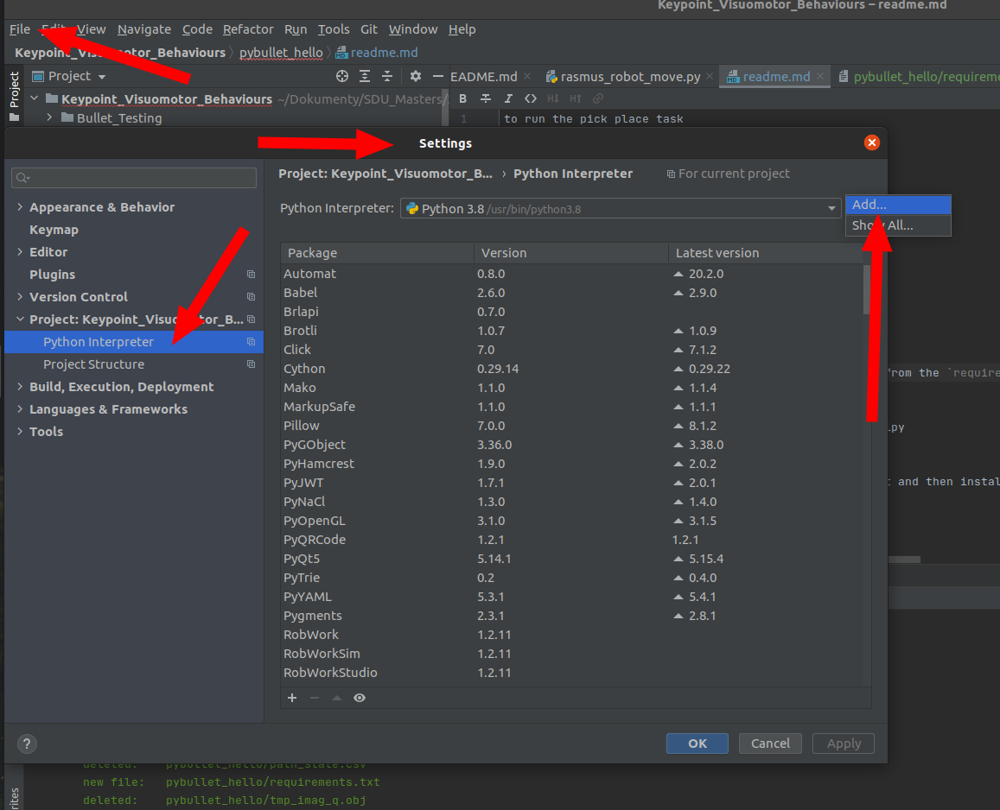
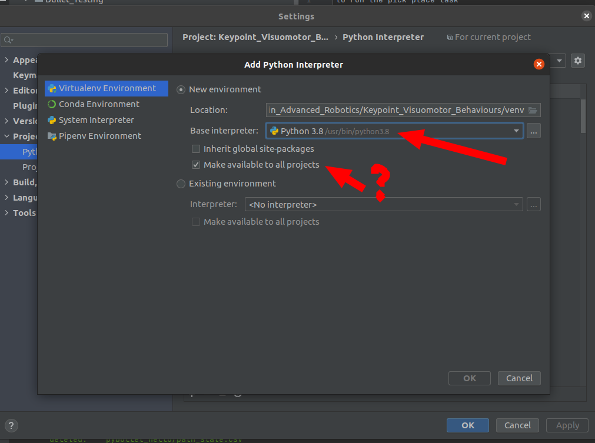
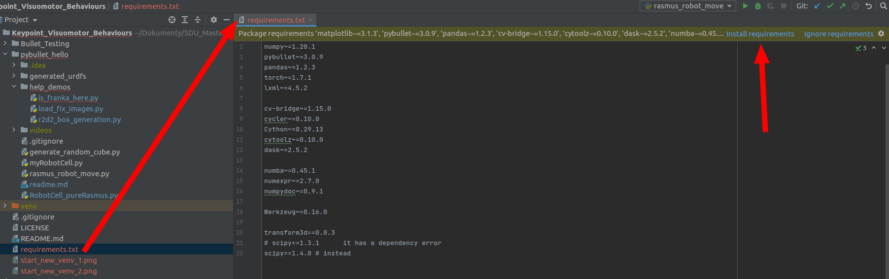

to run the pick place task

run the script "rasmus_robot_move.py"

myRobotCell.py is modified RobotCell from Rasmus's code

The original code can be found in RobotCell_pureRasmus.py

## Disclaimer! I didn't copy the vision functions yet

# Problems with transform3d
Hey - problems with transform3d
I hope the venv will be copied well to the git
Generally pyCharm will ask you to import the libraries from the `requirements.txt`
if it asks - just install it

The problem was with the versions of transform3d and scipy
but it turns out to work if you have correct versions

So the best idea would be to have an virtual environment and then install all the libraries from the `requirements.txt`.

to do so:

